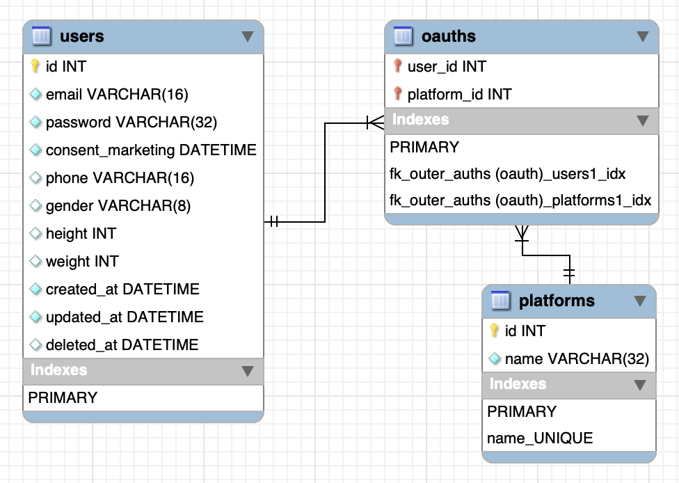

# 01주차 DB 설계

관계: users <--1:N--> oauths <--N:1--> platforms

## 테이블 별 칼럼
### users 테이블
- id : PK
- email : UQ, NN
- password : NN (bcrypt를 통한 보안 필요)
- gender : 
- height : 
- weight : 
- phone : XXX-XXXX-XXX의 형식
- consent_marketing : NN
- created_at : NN, default(생성 시의 now())
- updated_at : NN, default(생성 시의 now())
- deleted_at : default(null)

### platforms 테이블
- id : PK
- name : NN

### oauths 테이블
- users_id : PK, FK (유저 테이블 id)
- platforms_id : PK, FK (플랫폼 테이블 id)

## 보완 필요 사항
- users 테이블에 body(BWH둘레 및 팔-다리 길이) 정보 저장용 칼럼
- 